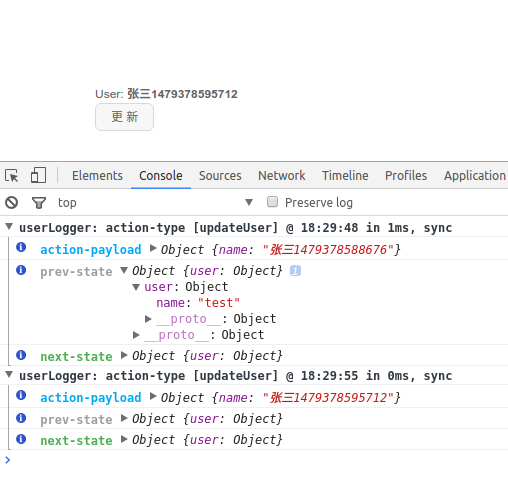

# relite-demo

把组件简单分类 , 写了两个hoc函数 , [`container`](./src/module/hoc/container.js), [`presentational`](./src/module/hoc/presentational.js)

用法见 [UserPage.jsx](./src/module/routes/UserPage.jsx),  [User.jsx](./src/module/components/User.jsx)

